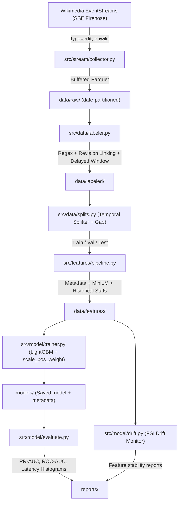

# 🛡️ Wikipedia Vandalism & Edit-War Detection

A production-grade, real-time machine learning system that detects vandalism and edit wars on Wikipedia using the live Wikimedia EventStreams firehose.

Unlike textbook tutorials that use synthetic toy datasets or random shuffling, this project tackles real-world streaming MLOps challenges:
- **Delayed Labels**: Edits are only known to be vandalism once reverted (minutes to hours later).
- **Extreme Class Imbalance**: Genuine vandalism represents ~3–5% of all edits.
- **Concept Drift**: Evolving topics, bot behaviors, and user editing patterns monitored via Population Stability Index (PSI).
- **Leakage Prevention**: Strictly temporal train/validation/test splits with configurable buffer gaps matching the label delay window.
- **Low-Latency Inference**: Sub-millisecond tabular inference combined with lightweight sentence transformer embeddings (`all-MiniLM-L6-v2`).

---

## 🏗️ Architecture



---

## 📁 Repository Layout

```
wiki-vandalism-detector/
├── config/
│   ├── default.yaml                # Default baseline configuration
│   └── experiments/
│       └── baseline.yaml           # Experiment overrides
├── src/
│   ├── stream/
│   │   └── collector.py            # EventStreams SSE consumer & Parquet buffer
│   ├── data/
│   │   ├── labeler.py              # Delayed revert-based labeling & API backfill
│   │   ├── splits.py               # Temporal splitting with label-delay buffer gap
│   │   ├── storage.py              # Parquet I/O utilities
│   │   └── synthetic.py            # Realistic synthetic edit event generator
│   ├── features/
│   │   ├── edit_features.py        # Tabular metadata & historical rolling features
│   │   ├── text_features.py        # Sentence transformer (MiniLM) embeddings + PCA
│   │   └── pipeline.py             # Feature pipeline fit/transform orchestrator
│   ├── model/
│   │   ├── trainer.py              # LightGBM classifier + Optuna hyperparameter tuning
│   │   ├── evaluate.py             # PR-AUC, optimal thresholding, latency benchmarking
│   │   └── drift.py                # Population Stability Index (PSI) drift detector
│   └── utils/
│       ├── config.py               # YAML configuration loader with inheritance
│       └── logging_setup.py        # Structured logging with Rich console output
├── scripts/
│   ├── generate_synthetic.py       # Generate realistic simulation data for testing
│   ├── collect_data.py             # Live stream collector (Wikimedia EventStreams)
│   ├── label_data.py               # Revert labeler
│   ├── build_features.py           # Feature engineering & temporal split generation
│   ├── train_model.py              # LightGBM model trainer
│   └── evaluate_model.py           # Evaluation, latency reporting & drift detection
├── tests/                          # Pytest unit tests for all components
├── pyproject.toml
└── .gitignore
```

---

## ⚡ Quickstart

### 1. Installation

```bash
cd wiki-vandalism-detector
pip install -e .
# Or install development dependencies:
pip install -e ".[dev]"
```

### 2. Fast End-to-End Simulation (Synthetic Data)

You can run the complete pipeline immediately without waiting for hours of stream collection:

```bash
# 1. Generate 10,000 realistic synthetic edits (with ~4% vandalism and delayed reverts)
python scripts/generate_synthetic.py --samples 10000 --days 30

# 2. Assign delayed revert labels
python scripts/label_data.py

# 3. Create temporal train/val/test splits and extract features
python scripts/build_features.py

# 4. Train LightGBM model with auto class weighting
python scripts/train_model.py

# 5. Evaluate on test split, measure inference latency, and check feature drift
python scripts/evaluate_model.py
```

All evaluation reports, PR/ROC curves, confusion matrices, and drift reports are saved to `reports/`.

---

## 🌐 Running on Live Wikipedia Firehose

Wikimedia's EventStreams is open and requires no API key.

```bash
# Collect live English Wikipedia edits (press Ctrl+C when ready)
python scripts/collect_data.py --wiki enwiki

# Run labeling on collected data
python scripts/label_data.py

# (Optional) Run with MediaWiki API backfill for unresolved edits:
python scripts/label_data.py --api-backfill

# Build features, train and evaluate
python scripts/build_features.py
python scripts/train_model.py
python scripts/evaluate_model.py
```

---

## 🧪 Running Tests

```bash
pytest tests/ -v
```

---

## 🔬 Core MLOps Design Principles

1. **Precision-Recall AUC as Primary Metric**: At 96% negative prevalence, accuracy is misleading (a naive classifier predicting all 0s has 96% accuracy). The system optimizes for PR-AUC and selects the optimal decision threshold via F1 maximization on the validation split.
2. **Delayed Labels & Pending State**: Edits younger than 48 hours are treated as `pending` (label = NaN) and excluded from training until their revert window has matured.
3. **Temporal Split Leakage Protection**: Splitting strictly on `timestamp` with a buffer gap between Train and Val/Test ensures zero data leakage across the 48-hour revert window.
4. **Production Concept Drift Monitoring**: Features are monitored between reference training distributions and incoming batches using the **Population Stability Index (PSI)**:
   - `PSI < 0.1`: Distribution stable
   - `0.1 <= PSI < 0.2`: Moderate shift
   - `PSI >= 0.2`: Significant drift triggering alerts
